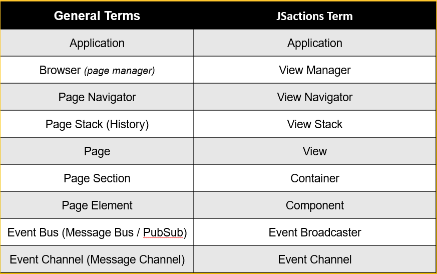

#

## In this tutorial you will learn

- How to create HelloWorld Application.

- How to create JSactions Scalable Application Architecture.

- How to create Custom Component

- How to create View (screen/page)

- How to create ViewNavigator

- How to create Path Route and Event Route

- How to create Navigation Event and Custom Component Event

- How to Bind Component property with Model.

## Download or clone App starter code

If you like start from scratch then skip download instruction.

Download or clone App starter code from github url : [https://github.com/jsactions/jsactionsappstarter](https://github.com/jsactions/jsactionsappstarter)

After downloading extract Zip Folder

## Typical UI Application structure vs JSactions Appstarter Application structure

JSactions recommends scalable and flexible architecture for application development from begining. It helps to reduce re-architecture or restructure as application grows. Developers who comes from Adobe Flex or Flash background will feel more similarity in architecture.

JSactions also support application as library module. JSactions itself is library module. If you like to develop your application as libary then refer core JSactions library packaging.

Below architecture shows how a typical UI requirement can be translate in JSactions recommended architecture.

- General UI application requirement statement :</br>
  **Hello World Application on start should navigate to "HelloWorld" page.**

- UI application layout as per above requirement:</br>
  Generally, during UI application development, we think from "page" or "screen" perspective and then how to integrate them using event or routing as shown in below image.
  </br></br>
  

- Equivalent JSactions Application layout as per above requirement:</br>
  JSactions application follows below terminology to translate General UI application in JSactions equivalent.
  </br></br>
  

  </br></br>
  According to JSactions terminology, equivalent application layout shown as below.
  </br></br>
  

## Summary of Steps to create HelloWorld Application

Let's follows belows steps to create Helloworld Application </br></br>

1. Create package.json

2. Create Application Folder structure

3. Create Application Class i.e "Application.js"

4. Create AppViewManager Class as ViewManager i.e "AppViewManager.js"

5. Create SimpleNavigator Class as ViewNavigator i.e "SimpleNavigator.js"

6. Create MyButton.js Class as Component i.e "MyButton.js"

7. Create HelloWorldModel Class as Model i.e "HelloWorldModel.js"

8. Create HelloWorldView Class as View i.e "HelloWorldView.js"

9. Create Application Launcher i.e "index.js" and "index.html"

10. Wiring all above Classes with Event,Path,BindingUtils

11. Compiling Application

12. Running And Preview of Application

### 1) Create package.json

Create package.json file as shown below.

1.  Create application folder i.e "HelloWorldApp" and Navigate to it.

    ```cmd
       C:\md HelloWorldApp
       C:\cd HelloWorldApp
       C:\HelloWorldApp\
    ```

2.  Run following command and answer questions
    Add "name","version","description","dependencies" and "devDependencies", **in dependencies" add "jsactions": "^1.0.0" package**.

    ```cmd
       npm init
    ```

3.  Above step will create "package.json" file as below</br>
    For detail contents of "package.json" open local file or browse [https://github.com/jsactions/jsactionsappstarter/blob/master/package.json](https://github.com/jsactions/jsactionsappstarter/blob/master/package.json)

   ```javascript
             {
               "name": "jsactionsappstarter",
               "version": "1.0.0",
               "description": "JSactions HelloWorld Application Starter ",
               "keywords": [
                     "jsactions",
                     "es6",
                     "router",
                     "event",
                     "binding",
                     "view",
                     "mvc"
               ],
               "main": "dist/jsactionsappstarter.js",
               "module": "dist/jsactionsappstarter.module.js",
               "browser": "dist/jsactionsappstarter.min.js",
               "npmName": "jsactionsappstarter",
               "npmFileMap": [
                     {
                        "basePath": "dist",
                        "files": [
                           "**/*"
                        ]
                     }
               ],
               "directories": {
                     "doc": "docs",
                     "lib": "dist",
                     "test": "tests"
               },
               "scripts": {
                     "preinstall": "npx npm-force-resolutions",
                     "build": "rollup -c",
                     "dev": "rollup -c --watch",
                     "reload": "livereload 'dist/'",
                     "watch": "npm-run-all --parallel dev reload",
                     "test": "echo \"No test specified\""
               },
               "author": "Gaurang Lade",
               "resolutions": {
                     "http-cache-semantics": "^4.1.1",
                     "ansi-regex": "^3.0.1",
                     "got": "^11.8.5"
               },
               "devDependencies": {
                     "npm-run-all": "^4.1.5",
                     "rollup": "^1.32.1",
                     "rollup-plugin-alias": "^2.2.0",
                     "rollup-plugin-copy": "^3.4.0",
                     "rollup-plugin-esm-import-to-url": "^2.1.0",
                     "rollup-plugin-livereload": "^2.0.5",
                     "rollup-plugin-serve": "^1.1.0",
                     "rollup-plugin-terser": "^5.3.1",
                     "rollup-watch": "^3.0.0",
                     "source-map": "^0.6.1",
                     "source-map-support": "^0.5.21"
               },
               "engine": "node >= 8.9.4",
               "dependencies": {
                     "jsactions": "^1.0.0"
               }

            }


   ```

4.  Now Run following command

    ```cmd
       npm install
    ```

5.  Verify in node_modules "jsactions" module install.

### 2) Create Application Folder structure

1.  Create Application directory structure as follows

    

2.  Create Blank Classes (.js files) in Application directory structure as follows

    

### 3) Create Application Class i.e "Application.js"

- Application Class require to create and launch "ViewManager". It also trigger initial navigation event to launch default ViewNavigator and default View.

- Create Application.js file in "src/app" folder.</br>

- Create new instance of AppViewManager which is subclass of ViewManager in intialize() method.

- In start method create "NavigationEvent" and dispatch it with EventBroadcaster as shown below code.

  ```javascript
  import { EventUtils } from "jsactions";
  import { EventBroadCaster } from "jsactions";
  import { NavigationEvent } from "jsactions";
  import AppViewManager from "./AppViewManager";

  class Application {
    constructor() {
      this.initialize();
    }

    initialize() {
      this.viewmanager = new AppViewManager();
    }

    start() {
      let helloNavEvent = new NavigationEvent(
        EventUtils.NAV_CHANGE_EVENT,
        "Hello_NavEvent",
        "Message :: Hello World !!!",
        "/hello"
      );

      //Dispatch Hello Navigation Event
      EventBroadCaster.navEventChannel.dispatchEvent(helloNavEvent);
    }
  }
  export default Application;
  ```

### 4) Create AppViewManager Class as ViewManager i.e "AppViewManager.js"

- Create AppViewManager.js file in "src/app" folder.</br>

- AppViewManager is subclass of ViewManager.

- Implement "initialize" method, "createNavigator" method and "initRoutes" method.

- "initialize" method override base ViewManager class method, and invoke "initRoutes" method to configure "path" routes as below to determine ViewNavigator specify in "createNavigator" method using "navigatorId".

- Path route object : **{ path: "/hello", navigatorId: "simpleNavigator",parentId: "root" }**

  Here in path route object, "path:/hello" is map to navigatorId: "simpleNavigator". </br>parentId which is DOM / jsactions object is map to ViewNavigator DOM element as parentId.

- For more details goto "ViewManager" class page.

  ```javascript
  import { ViewManager } from "jsactions";
  import { Router } from "jsactions";
  import { ViewNavigator } from "jsactions";
  import SimpleNavigator from "./navigators/SimpleNavigator";
  

      class AppViewManager extends ViewManager {

         initialize() {
            super.initialize();
            this.initRoutes();
         }

         createNavigator(_navigatorId, _parentId,_parentContainerId) {
            let tmpNavigator = null;
            switch (_navigatorId) {
                  case "simpleNavigator":
                     tmpNavigator = new SimpleNavigator(_navigatorId, _parentId,_parentContainerId);
                  break;

                  default:
                     tmpNavigator = new ViewNavigator(_navigatorId, _parentId,_parentContainerId);

            }
            return tmpNavigator;
         }

         initRoutes() {
            let tmpRoutes = [
                  { path: "/hello", navigatorId: "simpleNavigator",parentId: "root" }
            ];
            this.routes = new Router(tmpRoutes);
         }
      }

      export default AppViewManager;

  ```

### 5) Create SimpleNavigator Class as ViewNavigator i.e "SimpleNavigator.js"

- Create SimpleNavigator.js file in "src/app/navigators" folder.</br>

- SimpleNavigator is subclass of ViewNavigator.

- Implement "initNavigator" method, "createView" method, and "initEventRoutes" method.

- If you have custom navigation DOM template then implement it in "renderNavigatorContent" method.

- "initNavigator" method override base ViewNavigator class method, and invoke "initEventRoutes" method to configure "event" routes as below to determine Views specify in "createView" method using "viewId".

- Event route object : **{ navEvent: "Hello_NavEvent", viewstackId: "HelloWorldStack", viewId: "helloview", path: "/hello" }**</br>

Here in event route object,"navEvent: Hello_NavEvent" is map to viewId: "helloview" and viewstackId: "HelloWorldStack". </br> Also "path:/hello" is map to navigatorId: "simpleNavigator". </br>parentId which is DOM / jsactions object is map to ViewNavigator DOM element as parentId.

- For more details goto "ViewNavigator" class page.

   ```javascript

         import { ViewNavigator } from 'jsactions';
         import { EventRouter } from 'jsactions';
         import HelloWorldView from '../views/HelloWorldView';

         class SimpleNavigator extends ViewNavigator {
            constructor(_id, _parentId,_parentContainerId) {
               super(_id, _parentId,_parentContainerId);
            }

            initNavigator() {
               this.history = false;
               this.initEventRoutes();
            }

            createView(_viewId, _route, _navevent, _navparams, _viewStackId) {
               let tmpView = null;
               switch (_viewId) {
                     case "helloview":
                        tmpView = new HelloWorldView(_viewId, _route, _navevent, _navparams, _viewStackId);
                        break;
                     default:
                        tmpView = new View(_viewId, _route, _navevent, _navparams, _viewStackId);
                        break;

               }
               return tmpView;
            }

            initEventRoutes() {
               let helloEvntRoutes = [
                     { navEvent: "Hello_NavEvent", viewstackId: "HelloWorldStack", viewId: "helloview", path: "/hello" }
               ];
               this.eventRouter = new EventRouter(helloEvntRoutes);
            }
         }
         export default SimpleNavigator;

   ```

### 6) Create MyButton.js Class as Component i.e "MyButton.js"

- Create MyButton.js file in "src/app/components" folder.

- The Component class is the base class for all visual components. MyButton is subclass of Component

- For initializing MyButton Component, implement "init" method, "initComponent" method.

- For implementing DOM template use "createDOMContent" method.

- Base Component Class ensure to invoke eventHandling after Component render HTML DOM template. So implement eventHandling in "addEventHandler" method and binding property using "BindingUtils" in "bind" method.

- Following component properties are map to correspoding methods:

  1. For "enabled" implement "setComponentEnabled"
  2. For "readOnly" implement "setComponentReadOnly"
  3. For "required" implement "setComponentRequired"
  4. For "visible" base Component class have already implemented required functionality.

- For more details goto "Component" class page.

  ```javascript

   import {Component} from 'jsactions';
   import {Event} from 'jsactions';
   import {EventUtils} from 'jsactions';

   class MyButton extends Component {


      /**
      *Creates an instance of MyButton.
      * @param {*} [_id=null] - "jsact-component" wrapper id
      * @param {*} [_parentViewId=null] - Parent View ID
      * @param {*} [_parentContainerId=null] - Parent Container ID
      * @param {boolean} [_createDOMElement=true] - Set "True" if HTML Template of Component generate internally.  Set - False when Template designed externally.
      * @memberof MyButton
      */
      constructor(_id = null, _parentViewId = null,_parentContainerId=null, _createDOMElement = true) {
         super(_id, _parentViewId,_parentContainerId, _createDOMElement);
      }
  


      /**
      *
      * Lifecycle Method
      * @param {string} [_label="Button"]
      * @param {string} [_formId="defaultform"]
      * @memberof MyButton
      */
      init(_label="Button",_formId = "defaultform") {
         this.label = _label;
         this.formId = _formId;
         // call super class init method
         super.init();
      }


      /**
      *
      * Lifecycle Method
      * @memberof MyButton
      */
      initComponent(){
         super.initComponent();
      }


      /**
      * Create HTML Elements for Button
      * LifeCycle Method
      * @memberof MyButton
      */
      createDOMContent() {
         super.createDOMContent();
         let tmpCompContentEl = this.createComponentHTML();
         // Use following method to add Template to Component Wrapper
         this.addToComponentElement(tmpCompContentEl);
      }


      /**
      *
      * Call by Attached Method
      * Implement all Event Handlers here
      * LifeCycle Method
      * @memberof MyButton
      */
      addEventHandler() {
         super.addEventHandler();
         if(this.componentElement != null){
               let buttonEl = this.componentElement.querySelector("input[type='button']");
               buttonEl.addEventListener("click", (e) => { this.clickHandler(e); });
         }
      }

      clickHandler(event){
         event.preventDefault();
         let srcObjfrmEvt = event.target;
         console.log(srcObjfrmEvt.value + " :: HTML Button Click Event Received ::");
         console.log("MyButton Custom Click Event Dispatched")
         this.dispatchEvent(EventUtils.CLICK, this);
      }


      /**
      *
      * Implement Component Enabled here
      * this method call by "enabled" setter
      * @memberof MyButton
      */
      setComponentEnabled(){
         console.log(this.id+" Enabled = "+this.enabled);
         super.setComponentEnabled();
         let buttonEl = this.componentElement.querySelector("input[type='button']");
         if(this.enabled == false){
               buttonEl.setAttribute("disabled","disabled");
               buttonEl.classList.add("disablebutt");
         }else{
               if(buttonEl.hasAttribute("disabled")){
                  buttonEl.removeAttribute("disabled");
                  buttonEl.classList.remove("disablebutt");
               }
         }
      }

      /**
      *
      * Implement Component ReadOnly here
      * this method call by "readonly" setter
      * @memberof MyButton
      */
      setComponentReadOnly(){
         super.setComponentReadOnly();
      }

      /**
      *
      * call by createDOMContent
      * @memberof MyButton
      */
      createComponentHTML() {
         let btnHtml = `<input type="button" class="mybutton" value="${this.label}">`;
         return btnHtml;
      }

      }

      export default MyButton;

   ```

### 7) Create HelloWorldModel Class as Model i.e "HelloWorldModel.js"

- Models contain the data or state of an Views/Component or Application.

- Models hae properties which can then be retrieved and stored using the get and set methods.

- Using Eventful model which trigger event when any of its property get change. It is useful to free Views and Component from the necessity of being aware of each other.

- Binding Model property using "BindingUtils" helps make easy managing of Component or Model property change with less code.

- Below HelloWorldModel class is extends from Eventdispatcher class to generate "Custom Events" to make loosely coupled View, Component, Model with each other.

   ```javascript

      import { EventDispatcher } from 'jsactions';

      class HelloWorldModel extends EventDispatcher {
         constructor() {
            super();
            this.value = false;
            this.clickCount = 1;
         }

         incrementClick(){
            this.clickCount++;
            this.dispatchEvent("incrementEvent", this);
         }

         decrementClick(){
            this.clickCount--;
            this.dispatchEvent("decrementEvent", this);
         }

         getClickCount(){
            return this.clickCount;
         }

         setValue() {
            this.value = !(this.value);
            console.log("HelloWorldModel : value = "+this.value);
            this.dispatchEvent("change", this);
         }

         getValue() {
            return this.value;
         }
      }

      export default HelloWorldModel;

   ```

### 8) Create HelloWorldView Class as View i.e "HelloWorldView.js"

- View consider as single UI screen.

- View manages View Template or DOM Content such behaviour, event listners etc.

- View contains Contents consist of "Containers" and "Components" and Model. View created and manage by ViewNavigator.

- Create HelloWorldView.js file in "src/app/views" folder.

- The View class is the base class for all pages/screen. HelloWorldView is subclass of View class.

- For initializing HelloWorldView view, implement "initView" method.

- For implementing DOM template and creating Components use "createViewContent" method.

- Base View Class ensure to invoke eventHandling after View render HTML DOM template and Components. So implement eventHandling in "addViewHandler" method and binding property using "BindingUtils" in "bindView" method.

- For more details goto "View" class page.

  ```javascript
     
     import { View } from 'jsactions';
      import { ElementUtils } from 'jsactions';
      import { BindingUtils } from 'jsactions';
      import MyButton from '../components/MyButton';
      import HelloWorldModel from '../models/HelloWorldModel';


      class HelloWorldView extends View {

         constructor(_id, _route, _navevent, _navparams, _parentViewStackId) {
            super(_id, _route, _navevent, _navparams, _parentViewStackId);
         }

         initView() {
            super.initView();

            this.cmpButton1 = null;
            this.cmpButton2 = null;
            this.cmpButton3 = null;
            this.decreButton = null;
            this.myButtonModel = new HelloWorldModel();
         }

         //Overrides by SubClass
         // call by attachView
         bindView() {
            super.bindView();
            this.bindButtons();
         }

         /*
         Add HTML Element Event Handlers 
         call by attachView
         */
         addViewHandler() {
            super.addViewHandler();
            this.cmpButton2.addEventListener("click", (e) => 
            { 
                  //this.bindButtons() ;
                  console.log("clicked recevied"+e.target.enabled)
               });
         }


         bindButtons() {
            //let cmpButt2 = this.cmpButton2;
            //let cmpButt3 = this.cmpButton3;
            let labelEl = document.querySelector(".demobuttState");
            let labelClickEl = document.querySelector(".democlick");

            BindingUtils.addBinding(this.cmpButton1, "", "click", this.myButtonModel, "incrementClick", false);

            BindingUtils.addBinding(this.decreButton, "", "click", this.myButtonModel, "decrementClick", false);

            BindingUtils.addBinding(this.myButtonModel, "getClickCount", "incrementEvent", labelClickEl, "innerHTML", false);

            BindingUtils.addBinding(this.myButtonModel, "getClickCount", "decrementEvent", labelClickEl, "innerHTML", false);

            

            BindingUtils.addBinding(this.cmpButton2, "enabled", "click", this.myButtonModel, "setValue", false);
            BindingUtils.addBinding(this.myButtonModel, "getValue", "change", this.cmpButton3, "enabled", false);
            BindingUtils.addBinding(this.myButtonModel, "getValue", "change", labelEl, "innerHTML", false);
         }

         // call by attachView
         createViewContent() {
            let tmpViewContentEl = this.createViewHTML();
            this.addToViewElement(tmpViewContentEl);

            this.cmpButton1 = new MyButton("cmpBtn",this.id,"helloContainer",true);
            this.cmpButton1.init("My Component");
            this.cmpButton1.attach();
            this.cmpButton1.enabled = true;

            this.decreButton = new MyButton("decreBtn",this.id,"helloContainer",true);
            this.decreButton.init("Decrement Button");
            this.decreButton.attach();
            this.decreButton.enabled = true;


            
            // Add Break Element
            let buttonContEl = ElementUtils.container("helloContainer",this.id);
            //this.addBreakElement(buttonContEl);


            this.cmpButton2 = new MyButton("cmpBtn2",this.id,"bindDemoContainer",true);
            this.cmpButton2.init("Toggle Button");
            this.cmpButton2.attach();
            this.cmpButton2.enabled = true;

            // Add Break Element
            let bindContEl = ElementUtils.container("bindDemoContainer",this.id);
            this.addBreakElement(bindContEl);


            this.cmpButton3 = new MyButton("cmpBtn3",this.id,"bindDemoContainer",true);
            this.cmpButton3.init("Demo Button");
            this.cmpButton3.attach();
            this.cmpButton3.enabled = false;

            this.addBreakElement(bindContEl);
            this.addBreakElement(bindContEl);
         }

         createViewHTML() {
            let thisRef = this;
            let helloTmplHtml = `
               <div class="viewbg">
                  <div>
                  <p><h2>JSactionsjs AppStarter </span></h2></p>
                     <p><h3>Demo 1 : View Id is - <span class="redtext">${this.id} </span></h3></p>
                     <p><h4>Static View Contents Hello World !!!</h4></p>
                  </div>
                  <hr>
                  
                  <div> 
                  <p><h3>Demo 2 : Verifying Passing View Parameter during navigation event</h3></p>
                  <p> View Parameter Received ::: <span class="redtext">${thisRef.navParams}</span> </p>
                  </div>
                  <hr>
                  
                     <div>
                        <p> <h3>Demo 3 : Verifying Binding Custom Component Click using Model</h3></p>
                        <p> Click on below "My Component" Button to count number of clicks</p>
                        <p> <h4> "My Component" Button  Clicked <label class="democlick redtext" >0</label> times </h4></p>
                     </div>
                  <div class="jsact-container helloContainer"></div> 
                  <hr>
                  <div>
                        <p> <h3>Demo 4 : Verifying Binding Component Property using Model</h3></p>
                        <p> Click on below "Toggle Button" to Enable or Disable the "Demo Button" </p>
                        <p> <h4> "Demo Button" State : <label class="demobuttState redtext" >false</label> in Model </h4></p>
                     </div>
                  <div class="jsact-container bindDemoContainer"></div> 
            </div>
            `;
            return helloTmplHtml;
         }

         addBreakElement(_parentEl){
            let brakEl = `</br></br>`
            _parentEl.insertAdjacentHTML('beforeend', brakEl);
         }

         removeViewHandler() {
            super.removeViewHandler();
         }
      }

      export default HelloWorldView;

  ```

### 9) Create Application Launcher i.e "index.js" , "index.html" and "jsactionsappstarter.js"

- For launching HelloWorld application defined in "Application Class", initial launcher script is required.

- Create "index.js" file to create new instance of "Application" Class and then call "start()" method of it which will create "ViewManager" instance as shown in Step 3.

   ```javascript
      import {Application} from './module/jsactionsappstarter.js';

      const startApp = () => {
         let myApp = new Application();
         myApp.start();
      }

      startApp();
   ```
- Create "jsactionsappstarter.js" file to define exporting classes as to launch as modules dynamically.
  
   ```javascript
      export { default as Application } from './app/Application';
      export { default as AppViewManager } from './app/AppViewManager';
      export { default as HelloWorldView } from './app/views/HelloWorldView';
      export { default as SimpleNavigator } from './app/navigators/SimpleNavigator';
      export { default as MyButton } from './app/components/MyButton';
      export { default as HelloWorldModel } from './app/models/HelloWorldModel';
    ```

- Now finally in "src" folder create "index.html" file to include core "jsactions.min.js" library and Compiled application in file "jsactionsappstarter.js".

- Add some style for beautification of Component and View. See "index.html" file.

  

### 10) Wiring all Classes with Event,Path,BindingUtils

- Make sure to wire all classes listed below with Path route, Event Route, NavigationEvent and Binding.

- Application.js

  ```javascript
      // new instance of AppViewManager which is subclass of ViewManager
      this.viewmanager = new AppViewManager();

      // create NavigationEvent with "Hello_Event" as EventName, Event Type as EventUtils.NAV_CHANGE_EVENT, Naviation params as "My First Hello World Message as Navigation Param", Navigation path "/hello".

      let helloNavEvent = new NavigationEvent(
         EventUtils.NAV_CHANGE_EVENT,
         "Hello_NavEvent",
         "Message :: My First Hello World Message as Navigation Param",
         "/hello"
      );

      //Dispatch Hello Navigation Event
      EventBroadCaster.navEventChannel.dispatchEvent(helloNavEvent);
  ```

- AppViewManager.js

  ```javascript

     // Create path routes object.
     let tmpRoutes = [
              { path: "/hello", navigatorId: "simpleNavigator",parentId: "root" }
        ];
        this.routes = new Router(tmpRoutes);

     // create "SimpleNavigator" instance from navigatorId "simpleNavigator" configure above.
     case "simpleNavigator":
                 tmpNavigator = new SimpleNavigator(_navigatorId, _parentId,_parentContainerId);
     break;

  ```

- SimpleNavigator.js

  ```javascript

     // make Navigator false
     this.history = false;

     // Create event routes object.
     let helloEvntRoutes = [
              { navEvent: "Hello_NavEvent", viewstackId: "HelloWorldStack", viewId: "helloview", path: "/hello" }
        ];
     this.eventRouter = new EventRouter(helloEvntRoutes);

     // create "HelloWorldView" instance from viewId "helloview" configure above.
     case "helloview":
        tmpView = new HelloWorldView(_viewId, _route, _navevent, _navparams, _viewStackId);
     break;

  ```

- MyButton.js

  ```javascript

     // handle click event of DOM button element and dispatch "custom" click event.
     clickHandler(event){
        event.preventDefault();
        let srcObjfrmEvt = event.target;
        console.log(srcObjfrmEvt.value + " :: HTML Button Click Event Received ::");
        console.log("MyButton Custom Click Event Dispatched");
        this.dispatchEvent(EventUtils.CLICK, this);
     }

  ```

- HelloWorldModel.js

  ```javascript

     // increase click count of "this.clickCount" property and dispatch custom event "incrementEvent".
     incrementClick(){
        this.clickCount++;
        this.dispatchEvent("incrementEvent", this);
     }

     getClickCount(){
        return this.clickCount;
     }

     // set value of "this.value" property and dispatch custom event "change".
     setValue() {
        this.value = !(this.value);
        console.log("HelloWorldModel : value = "+this.value);
        this.dispatchEvent("change", this);
     }

     getValue() {
        return this.value;
     }

  ```

- HelloWorldView.js

  ```javascript

     // initialize view components as property and HelloWorldModel also.
     this.cmpButton1 = null;
     this.cmpButton2 = null;
     this.cmpButton3 = null;
     this.myButtonModel = new HelloWorldModel();

     // call bindButtons to bind Button propety with model and create chain binding.
     bindButtons() {
        let labelEl = document.querySelector(".demobuttState");
        let labelClickEl = document.querySelector(".democlick");

        BindingUtils.addBinding(this.cmpButton1, "", "click", this.myButtonModel, "incrementClick", false);

        BindingUtils.addBinding(this.myButtonModel, "getClickCount", "incrementEvent", labelClickEl, "innerHTML", false);

        BindingUtils.addBinding(this.cmpButton2, "enabled", "click", this.myButtonModel, "setValue", false);
        BindingUtils.addBinding(this.myButtonModel, "getValue", "change", this.cmpButton3, "enabled", false);
        BindingUtils.addBinding(this.myButtonModel, "getValue", "change", labelEl, "innerHTML", false);
     }
  ```


### 11) Compiling Running HelloWorldApp

- Run following command to compile HelloWorldApp.

 ```javascript
      c:\jsactionsappstarter\npm run build
 ```

### 12) Running And Preview of Application

- Running Application </br>
After compilation successfully following log  will appear on command line.

   ```cmd
      ./src/index.js → dist/jsactionsappstarter.js
      http://localhost:10001 -> C:\jsactionsappstarter
   
   ```

- Application Preview </br>
  Now in browser type "<http://localhost:10002"> to open Application (see preview below)

  
